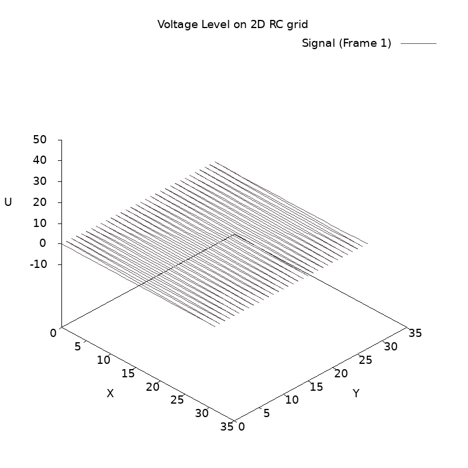

# **System programming on Linux**

## `fork/`: multiprocessed application example
Simple application with kernel process that spawns four children to process strings.
Processes communicate via signals (`SUGUSR1`).
Noncanonical input and `<time.h>` are utilized for better CLI experience.

## `thread/`: multithreaded application example (using POSIX theading)
The example contains ODE solver for 2D mesh of RC-circuits. Integration is performed
via forward Euler method (thus, only 2 buffers are required at each time step).
The original matrix is split between given number of threads (in this implementation,
the number of matrix rows should be divisible by the number of workers).
Also, a benchmarking example on 1024x1024 grid is provided to expose the performance boost when
processing is split between multiple threads.

## `socket/`: simple http client
This client behaves like a browser in the sense that it displays the http response and searches
for all `<a>` tags on the page, asking user to choose the next request target.

### Notes on numerical stability (for `thread/`):
One expected yet nice result I managed to obtain is the presence of numerical instability
of forward Euler method, which is well-known both for speed and worst possible accuracy
(as the culumative error is `O(n)`).
The point is, with integration step `h=0.5` the solution clearly diverges as the oscillations
grow over time. However, with `h=0.25` (just twice as small!), the problem is solved fine,
see the gifs below:

**This solution is OK for 250+ steps (`h=0.25`):**

**This one diverges before the number of steps reaches 50! (`h=0.5`)**

